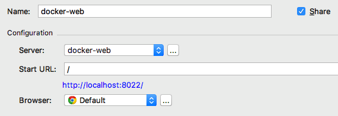
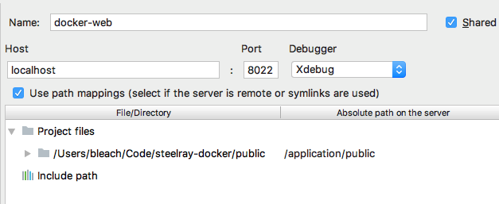

# Developing in PHP Using Docker

When I first starting developing web applications, I used FTP and other methods to update a "staging" version of my website.  This was a pain, so I was happy when tools like XAMPP came along which bundled my technology stack (Apache, MySQL, PHP) to make it faster and easier to test and debug locally.

I used XAMPP for many years, until I discovered Vagrant.  

Vagrant made it fairly easy and quick to set up a virtual server with the technology stack that I needed, so I thought I'd be a Vagrant user for quite some time.

Until I came across container technology, specifically Docker.

## What is Docker?

Containers allow developers to package applications with all of the parts it needs and little else. With Vagrant, five virtual machines gave you five copies of Linux.  With containers like Docker, each container shares the same operating system: the one on your host.  The upside:  better performance and a smaller footprint.

## This Tutorial

In this tutorial, I'll show you how simple it is to set up Docker on a Mac and debug and test a PHP/MySQL web application.

You'll notice a few really nice benefits of using Docker:

1. It won't take very long to set up.
2. It won't use a lot of space.
3. You'll make no changes to the actual container.  You won't need to ssh into it for any reason.Recruit
4. The container will be quite disposable.  Meaning:  you can delete it and create a new one without losing anything.
5. You can use the tools on your Mac -- your IDE, your mysql client, etc.

## Step 1: Install Docker for Mac

Visit <https://www.docker.com/docker-mac> and download Docker for Mac.  It's free!

## Step 2: Build and Extract a Docker Compose File

We're going to take a shortcut in creating our Docker configuration -- an extremely helpful online tool I found at **phpdocker.io**.  The tool allows you to fill out a simple form and generate the config files that you'll need to build your containers.

Visit <https://phpdocker.io/generator>.  Fill in the following fields:

- *Project Name* - Call it whatever you like.  Don't use spaces.  Example: ```docker-web```
- *Base port*:  Use something you're not already using on your local machine.  Example: ```8022```.  Whatever you use, you'll use later when you browse to your site, e.g. ```http://localhost:8022```
- *Extensions*: Select ```mysql``` and ```xdebug```.
- Turn on the switch for mysql (or MariaDB or Postgres) if you need a database.
  - If you do so, you'll be asked for account names and passwords.  It doesn't matter what they are right now, so I'm filling in random values.
  - root user pass: PestoMadnessFestival
  - app database name:  MyAwesomeDb 
  - app database username: victortequila
  - app database password: DropIcyBackpacks

- Click *Generate Project Archive*.  A zip file will download.
- Move the file to the location where you want the sandbox.  You do *not* need to create a new directory for it.  The root directory in the zip file will be whatever you named your project.  I moved mine into ~/Code
- Extract the zip file.

Here's what you'll have in your sandbox after you extract the file:


### docker-compose.yml

docker-compose is a tool that lets you define multiple Docker containers in one file.  The contents of our docker-compose.yml file:

```
###############################################################################
#                          Generated on phpdocker.io                          #
###############################################################################
version: "3.1"
services:

    mysql:
      image: mysql:8.0
      container_name: docker-web-mysql
      working_dir: /application
      volumes:
        - .:/application
      environment:
        - MYSQL_ROOT_PASSWORD=PestoMadnessFestival
        - MYSQL_DATABASE=MyAwesomeDb
        - MYSQL_USER=victortequila
        - MYSQL_PASSWORD=DropIcyBackpacks
      ports:
        - "8024:3306"

    webserver:
      image: nginx:alpine
      container_name: docker-web-webserver
      working_dir: /application
      volumes:
          - .:/application
          - ./phpdocker/nginx/nginx.conf:/etc/nginx/conf.d/default.conf
      ports:
       - "8022:80"

    php-fpm:
      build: phpdocker/php-fpm
      container_name: docker-web-php-fpm
      working_dir: /application
      volumes:
        - .:/application
        - ./phpdocker/php-fpm/php-ini-overrides.ini:/etc/php/7.1/fpm/conf.d/99-overrides.ini


```

We have 3 entries in the services section:  mysql, webserver, and php-fpm.  These are pretty self-explanatory:  one container is created for the database, one for the web server (nginx), and one for PHP.

**image** specifies the image to start the container from.  Since the image doesn't currently exist, Docker will pull it from a public repository.  Note that **php-fpm** has a **build** item instead.  In this case, a path is provided to a build context.  If you follow that directory path, you'll see a separate Dockerfile.

**container_name** allows you to override the container name that Docker would otherwise generate for you.

**working_dir** specifies the working directory of the container that is created.  In all 3 containers, the path is /application.

**volumes** specifies file and directory mappings from your machine (e.g. your Mac) to the container's file system. The line:

~~~
.:/application
~~~

is shorthand syntax for mapping the current directory on your Mac (where the docker-compose.yml is) to the directory /application in your container.

Note that the webserver container adds a second mapping: 

```
./phpdocker/nginx/nginx.conf:/etc/nginx/conf.d/default.conf
```

The nginx.conf file that you unzipped becomes the actual configuration file for the webserver.  This lets you edit it locally on your Mac.

**environment** lets you set environment variables that will be active inside the container.  In the mysql container, you can see the database information we set on phpdocker.io.  

Finally, **ports** lets you specify a port mapping from your local host to your container.  In the webserver container, we can see that port 80 is mapped to port 8022 on our Mac.  You can also see that the standard port for mysql (3306) is mapped to port 8024 on our Mac.   This allows you to use the database using a local client.

#### A Quick Change to the location of the database . . .

By default, our database will be stored on the container in ```/var/lib/mysql```.  Because we want our containers to be completely disposable, let's map that directory on the container to one on our Mac.  For example, /Users/yourname/mysql. Create that folder, and in the mysql service section of docker-compose.yml, change the mapping from: 

```
volumes:
  - .:/application
```

to:

```
volumes:
  - /Users/yourname/mysql:/var/lib/mysql
```

## Step 3: Running the Container

docker-compose is the command you use for running multiple-container Docker applications.  To run the containers, issue the following command from your sandbox directory:

```
docker-compose up -d
```

The -d option (for detached, but it could also stand for daemon) tells the command to run in the background.

The first time you run the command will be different from subsequent runs. Because it hasn't bee run before, some software needs to be downloaded, and in the case of the php-fpm container, built.

## Step 4: Sanity Test
Before we run a quick test, if you take a look at the nginx config file, located in docker-web/phpdocker/nginx/nginx.conf, you'll see a pretty standard setup.  I'll call attention to one line:

```
root /application/public;
```

In the container, it specifies that the root directory of the website is /```application/public```. Because /application maps to our sandbox directory (remember that from the docker-compose.yml file?), that means we can create a directory called public in our sandbox and that will be the root of the website.

Let's test our newly built containers with a simple php file.

```
$ mkdir public
$ cd public
$ cat > index.php
<?php echo "Hello!"; ?>
(ctrl-d to exit)
$ 
```

And when we browse to the root of the website, we see:


## Step 5: Link to Your Real Website

Now that we have our containers up and running, let's run with our real application.

We don't want to copy our application into our docker-web directory, so we'll simply change the mappings in our docker-compose.yml file:

In the webserver and php-fpm containers, we'll change the mapping from: 

```
- .:/application
```

to:

```
- [Path-to-your-website-files]:/application/public
```

Now we have to restart the containers:

```
docker-compose restart
```

If all went well, you can browse to ```localhost:8022``` and see your web application.

## Step 6: Load Your Database

In the docker-compose.yml, mysql is mapped from the default (3306) to port 8024 on my Mac.  So, we can connect to it from mysql on the Mac:

```
mysql -uroot -p -h 127.0.0.1 -P 8024
Enter password: 
Welcome to the MySQL monitor.  Commands end with ; or \g.
```

Remember to use the mysql root password from the docker-compose.yml file.  

Using a backup file, it's easy enough to load the database for the application:

```
mysql> create database appdb;
Query OK, 1 row affected (0.00 sec)

mysql> use appdb;
Database changed

mysql> source appdb_backup.sql;
```

And now we have a fully stocked database.

## Step 7: Get Debugging Working

Before I do any kind of development, the first thing I want to make sure of is that I can debug my code -- set breakpoints, single-step, etc.

When we created our container, we specified that the xdebug extension should be included in the web server. The challenge is that xdebug on the container needs to communicate with the host.  The host, however, cannot be counted on to always have the same IP address.  Docker for Mac provides a DNS name (```docker.for.mac.localhost```) which will always resolve to the internal IP address used by the host.  Pretty cool, right?

We have to make a slight change to the PHP config file.  In the ```phpdocker/php-fpm/php-ini-overrides.ini```, we add 3 lines:

```
xdebug.remote_enable=1
xdebug.remote_host=docker.for.mac.localhost
xdebug.remote_connect_back=0
```

**Important:** After changing the file, be sure to restart the container by running ```docker-compose restart```.

### Example: Debugging in PHPStorm
To set up debugging, I'll use PHPStorm as an example, but the principles are the same for other IDEs or debuggers.

#### Run/Debug Configuration


#### Server Configuration


## That's It!

As you can see, using Docker for your development sandbox is quick and easy, with minimal impact on your development machine.  There's a lot more to explore, but this should give you a good head start on your exploration.


